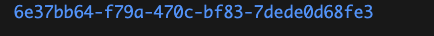
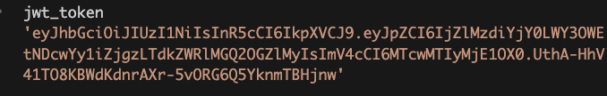
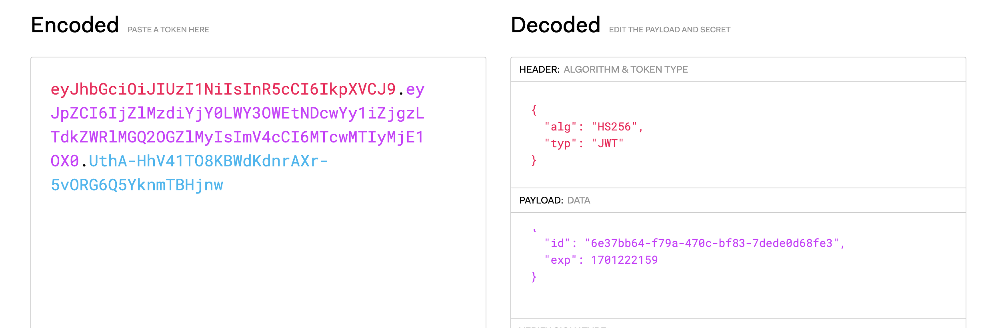
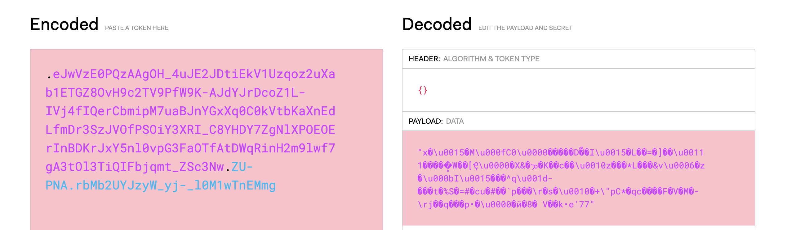

Tokenized Auth.

The Premise of this codebase is to illustrate token generation that uses JWT as a base level data encoder this is pretty much straight forward and it is similar to what everyone does accross code bases irrespective of languages [Python, PHP, JavaScript, GO, Ruby].
We sign tokens and decode them. 


```python
# create JWT  
def create_access_token(data: dict):
    expire = timedelta(minutes=ACCESS_TOKEN_EXPIRE_MINUTES) + datetime.utcnow()
    data.update({"exp": expire})
    return jwt.encode(claims=data, key=SECRET_KEY, algorithm=ALGORITHM)

# Decode JWT
def verify_access_token(token: str):
    # Ideal implementation use redis to black list token example is the below:
    # cache_token = redis_utils.get_token_blacklist(token=token)
    # if cache_token:
    #     raise HTTPException(detail="black-listed token", status_code=401)

    cached_token = BLACK_LIST_STORE.get(token)
    if cached_token:
        return "Access Blocked, Token Invalidated"

    try:
        payload = jwt.decode(token=token, key=SECRET_KEY, algorithms=[ALGORITHM])

        id: str = payload.get("id")
        if id is None:
            LOGGER.error(f"Decrypted JWT has no id in payload. {payload}")
            # raise the HTTP Exception
            return "token payload error"

        token_uid = UUID(id)
    except (JWTError, ExpiredSignatureError) as e:
        LOGGER.exception(e)
        LOGGER.error("JWT Decryption Error")
        return "jwt token broken"

    return token_uid

```


The Codebase sample above creates JWT and this token can be decoded with the verify_access_token function.

Idealy instead of strings/messages being returned HTTPException can be raised.

The above is the conventional method, and i propose a top layer. JWT's a Decodeble as can be here, the token generated



Generated JWT



Decoding the JWT with https://jwt.io



But with my proposed method of creating access token which layers another package in python, the itsdangerous package. This uses another signer to sign the generateed JWT and that returns another token.

This token, thanks to the secret used and algo  used is not decodeble by https://jwt.io. 
To prove that I will use the JWT above and sign above that token to generate the undecodeble token.

Here is the seconded signed token.


Here is the failed decode by jwt.io.



The auth_utils script contains functions with second_signer imbeded to create access and refresh token.